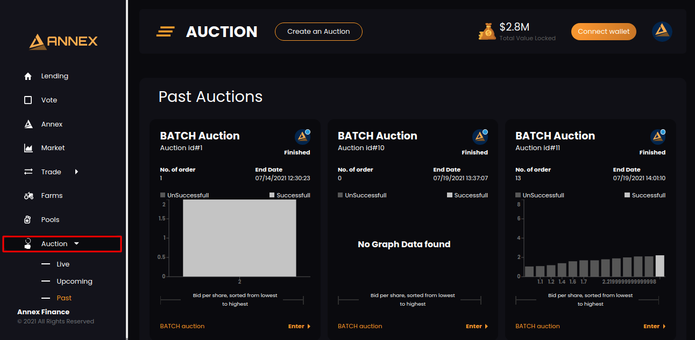
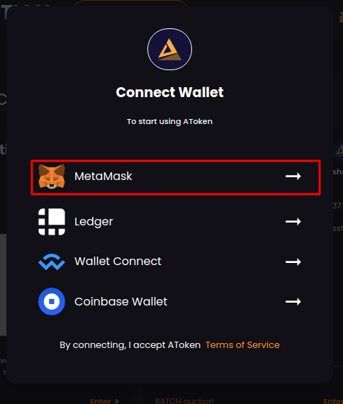
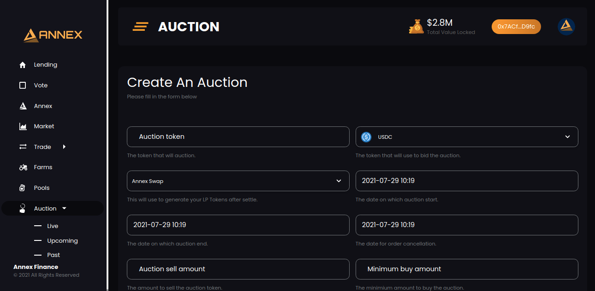
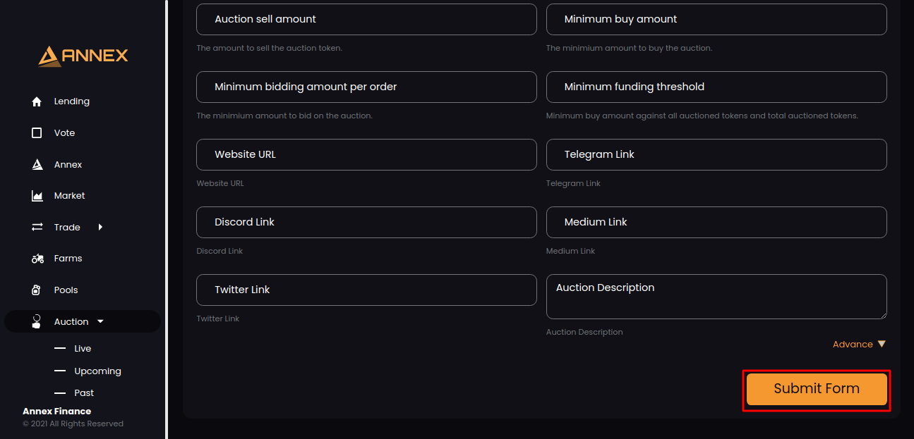
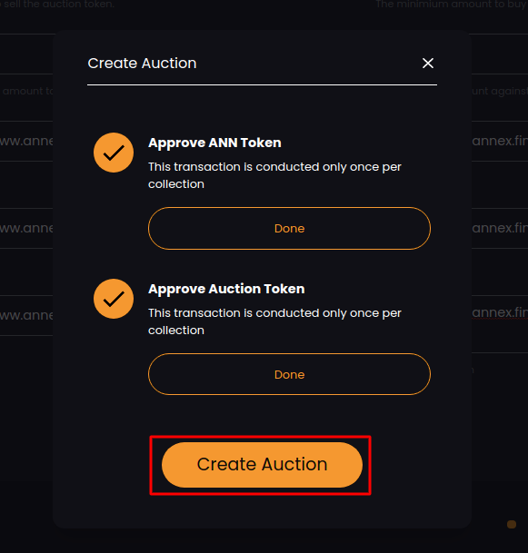
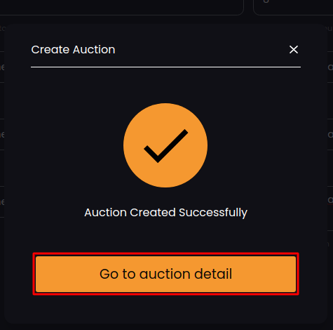
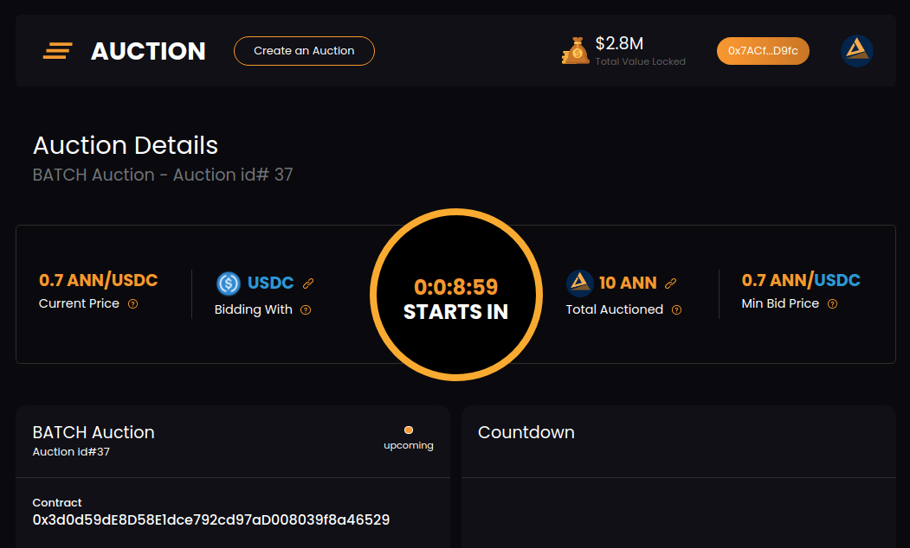

# Create Auction

## Create Auction Process

Select Auction from left menu

You need to connect with **metamask**. Click on connect wallet:

Click on Create an Auction button:

Now, You will have create auction page.

Fill all the information and click on Submit Form:

We will be verifying following checks before transaction: 

1. **Approve ANN Token**
2. **Approve Auction Token**

If above checks validated successfully you will see tick mark. Otherwise cross mark will be visible for failed checks.

Now click on Create Auction button and wait to complete transaction. Once transaction completes you will see success popup:

Click on Go to Auction Detail and you will have complete auction detail like below:

