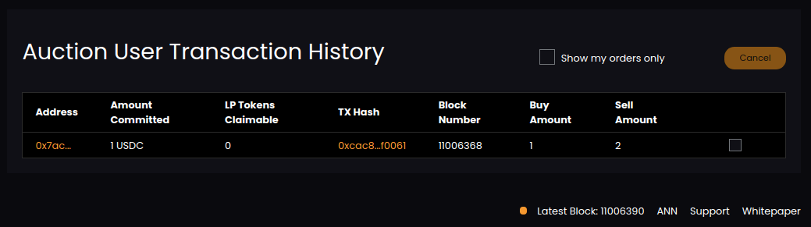
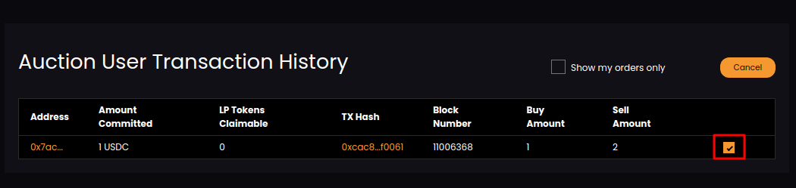
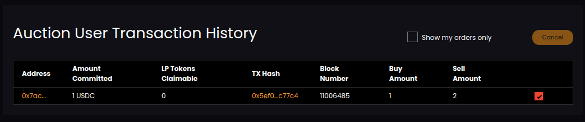

# Cancel Auction Bid

You can view all your auction bid in Transaction History section.

If you want to cancel any bid. Select that bid by clicking on checkbox.

Click on cancel button. Once the bid cancellation process completes, you will have bid with updated cancel status.

