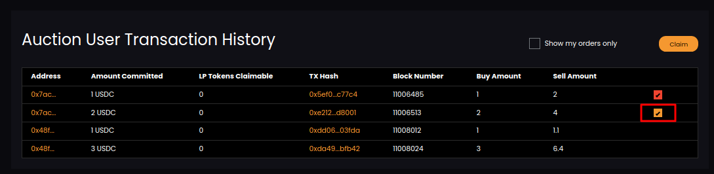
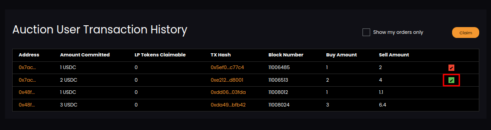

# Claim Auction

Go to Auction User Transaction History section. You will have list of your created bids with claim checkbox. Select any auction bid like below.

Click on Claim button. After successful claim you will have claimed auction bid.

