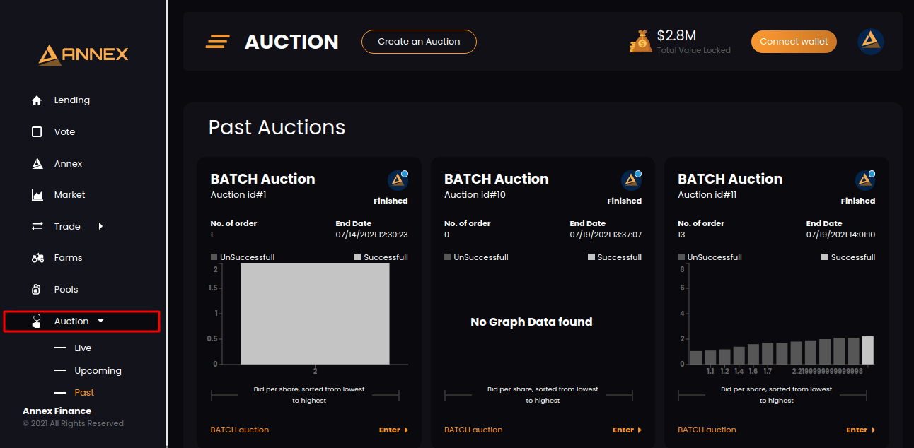

# Create Bid

Click on Auction in left menu

Click on Live sub-menu:

You will see all auction on which you can place bid. Select anyone auction or click on Enter:

Once you click on Enter button. You will be redirected to particular auction detail page.

Go to Auction Progress section. Enter values in Sell Amount and Min Buy Amount fields and click on Commit button.

Now, click on submit button:

Once you click on submit button. Your will have below popup after successful commit.

You will be able to see your bid like below in Auction Progress section:

Similarly, Auction User Transaction History table will be updated as per latest bid:

Transaction History shows all bid on this auction. You can filter your bid by checking the Show my orders only.

Now, You will see only your bids like below.

