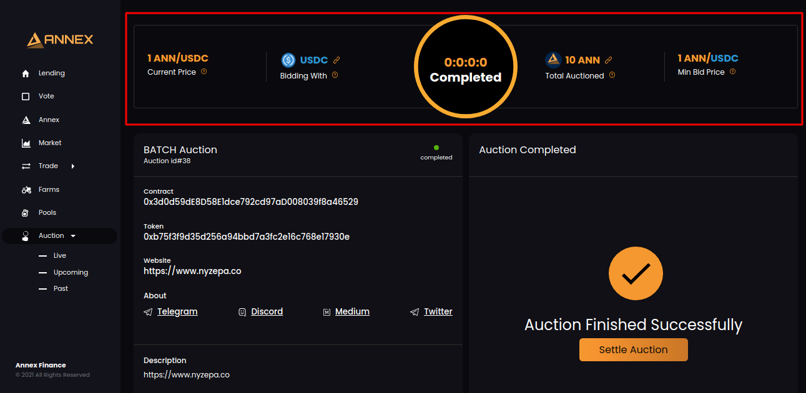
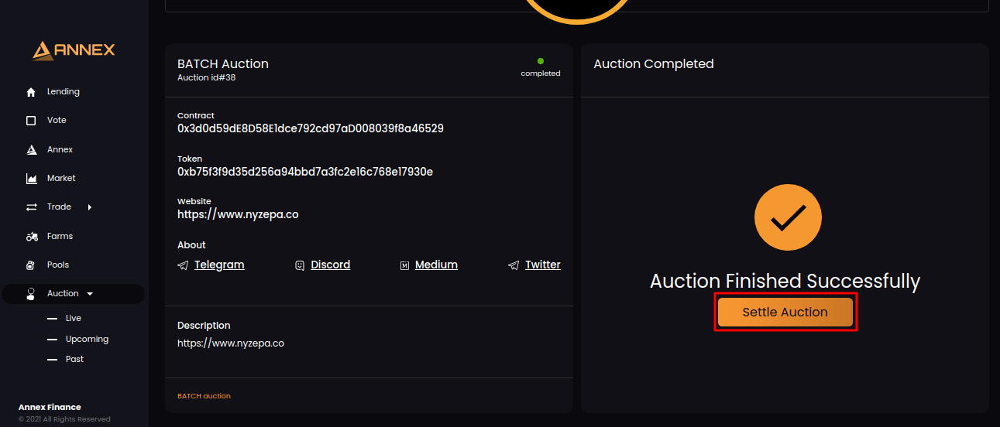
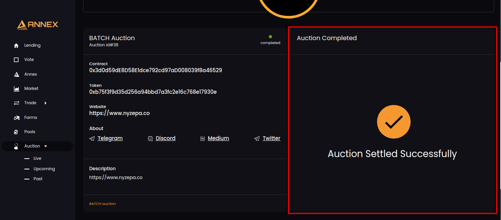
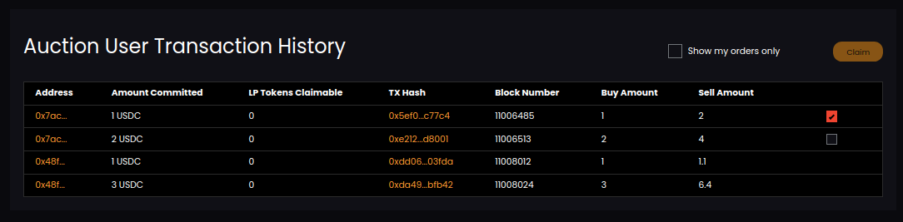

# Settle Auction

When auction time ends. You will see below screen:

Click on Settle Auction button:

Once auction settled successfully. You will have success message.

After successful suction settlement, You will have your bid data in transaction history like this:

Only current user bids will be available for claim. Other bid will be disabled with no checkbox. 

Proceed further you claim auction.

